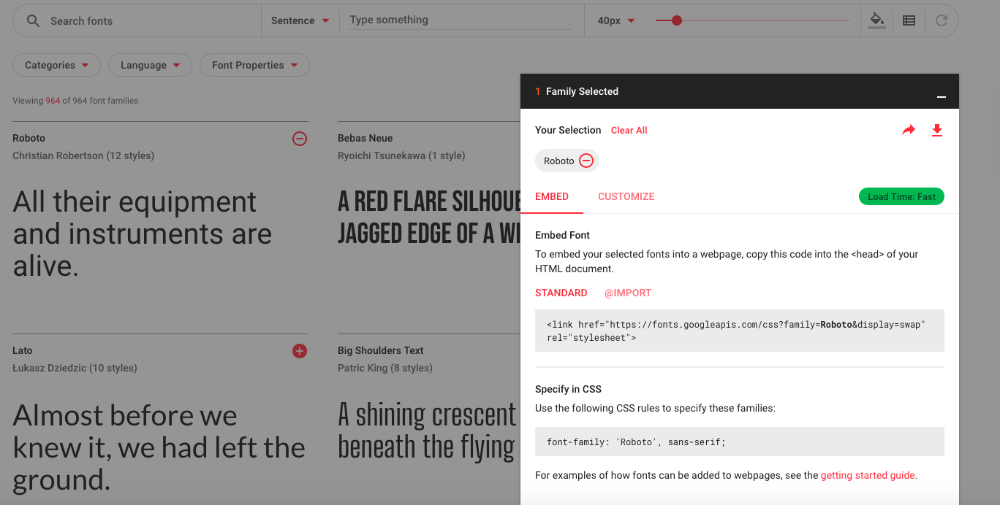
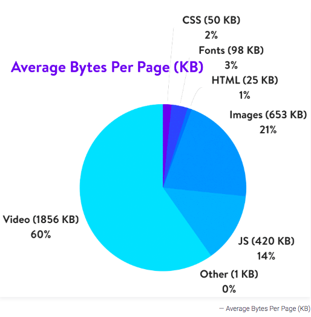
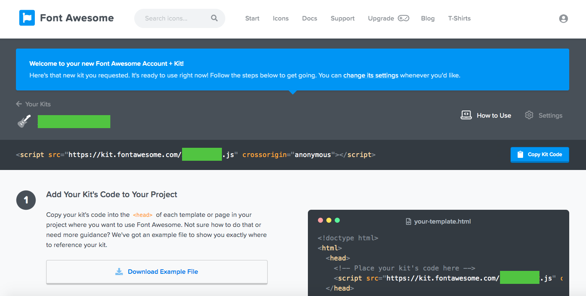
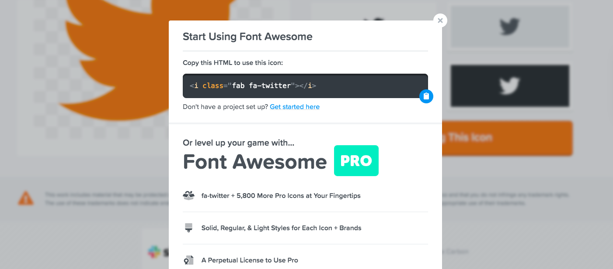

# Lezione 8

## CSS: alcune istruzioni

#### 1. Colori

I colori possono essere applicati fondamentalmente a **tre oggetti** di una pagina web: testo (e.g. `p`, `section`, `nav ul li`, `i`, `a`), background (e.g. `body`, `section`) e bordi (`border`).

Per identificare un colore RGB si possono utilizzare (alternativamente e indifferentemente) **tre notazioni**: `nome valido`, `rgb (n,n,n)` e esadecimale `#alfanumerico`. Utilizziamo (tra i tanti disponibili online) il tool fornito da [Adobe color](https://color.adobe.com/it/) per scegliere e copiare gli identificativi dei colori scelti.

N.B. Non tutti i colori hanno un `nome valido`.

Per esempio:

**Testo**

~~~~
html {
 color: rgb(99,99,99);
}

header {
 color: white;
}
~~~~

**Background**

~~~~
body {
 background-color: white;
}
~~~~

**Bordi**

~~~~
nav {
 border-bottom: solid 4px rgb(181,181,181);
}
~~~~

#### 2. Font

CSS permette di intervenire sulla scelta e la visualizzazione delle font in diversi modi. I computer hanno normalmente un set di font di default (e.g. Times New Roman, Arial) che possono essere utilizzati anche dal browser (quanti e quali dipende dai sistemi operativi, vedi [qui](https://www.w3.org/Style/Examples/007/fonts.en.html) una possibile lista).

Buona pratica prevede di dichiarare una font di default per tutta la pagina html (i.e. applicata all'elemento `html`) e di dichiarare altre istruzioni per gli elementi specifici che avranno un'altra font.

**Dichiarare una font family**

Si dichiara il nome della font (presa da un vocabolario controllato) e un’alternativa in caso il browser dell'utente non possieda quella font. In questo secondo caso specifichiamo solo il tipo della font (e.g. `serif`, `sans-serif`)

~~~~
html {
  font-family: "Georgia", serif;
}

h2, h3 {
  font-family: "Arial", sans-serif;
}
~~~~

**Grandezza dei caratteri**

Le nuove tendenze in web design vogliono titoli molto grandi, testo spaziato e comunque grande, per facilitare la lettura.

~~~~
main {
 font-size: 1em;
 font-family: ‘Times’, serif;
}
~~~~

**Interlinea**

Buona pratica è mantenere un’interlinea proporzionata alla grandezza del font (misura in em).

~~~~
main {
 line-height: 1.5em;
}
~~~~

**Spaziatura tra i caratteri**

Buona pratica è spaziare le lettere nelle testate (titoli), utilizzando una misura proporzionale alla grandezza della font. La spaziatura tra le lettere peggiora invece la leggibilità nei testi lunghi (quindi non serve dichiararla).

~~~~
h2, h3 {
 letter-spacing: 0.05em;
}
~~~~

**Applicare stili ad una font**

Si può modificare l’aspetto di una font in diversi modi:

 * stile
  ~~~~
  h4 {
     font-style: italic;
  }
  ~~~~

 * decorazione
  ~~~~
  a:hover {
     text-decoration: underline;
     font-weight:bold;
  }
  ~~~~

 * lower/uppercase
  ~~~~
  p::first-letter {
      font-size: 5em;
      color: rgb(181,181,181);
      text-transform: uppercase;
  }
  ~~~~

**Quali alternative ai font di default del mio coumputer?**

 1. inserire i file di una font (di solito file in formato `.woff` o `.otf`) nella cartella del sito e _importare_ la font nel css (leggi [qui](https://www.pagecloud.com/blog/how-to-add-custom-fonts-to-any-website) per approfondire)

 2. utilizzare link a font (open source) forniti da alcuni provider, e.g. [Google Fonts](https://fonts.google.com/).  Possiamo o _importare_ la font nel documento css o inserire un link nella pagina HTML (nell'elemento `head`).

Per esempio, importiamo il font di Google chiamato `Roboto` nella pagina html.

Selezioniamo la font (clicchiamo sul tasto `+` a destra del nome della font). Compare un tab in basso a destra, clicchiamo per espanderlo e leggiamo le istruzioni per l'_embedding_.

Copiamo il link fornito (alla voce `STANDARD`) nel nostro documento html all'iterno dell'elemento `head` (l'ordine rispetto agli altri elementi in `head` non è rilevante, per semplicità mettiamolo prima della dichiarazione del nostro foglio di stile).

~~~~
<link href="https://fonts.googleapis.com/css?family=Roboto&display=swap" rel="stylesheet">
~~~~

Leggiamo come dichiarare questa famiglia in CSS (voce `Specify in CSS`) e applichiamola agli elementi desiderati, e.g.

~~~~
nav {
  font-family: 'Roboto', sans-serif;
}
~~~~

#### 3. Immagini

Le immagini sono tra gli oggetti più difficili da gestire, poichè si comportano diversamente dal testo con il cambiare della larghezza/altezza del device.

Per consentire alle immagini di _scalare_ assieme alla grandezza del device usiamo immagini con le seguenti caratteristiche:

 * non servono immagini di eccessiva altà **qualità**, poichè questa è comunque limitata dalle prestazioni di visualizzazione dei browser (96ppi o 300ppi per i display retina)
 * non bisogna usare **file** di grandi dimensioni (in termini di KB o MB), poichè rallentano il caricamento della pagina da parte del browser
 * utilizziamo immagini tra i 1500 e i 2500 pixel di **larghezza**

Normalmente le immagini per il web vengono **ottimizzate** utilizzando tool appositi, per scalare al variare della larghezza del device e non appesantire il caricamento della pagina. L'obiettivo è trovare un compromesso tra dimensioni del file e qualità dell'immagine. Tra i tool consigliati troviamo (Adobe Photoshop, Gimp, Paint.NET, GIFsicle, JPEGtran, JPEG Mini, OptiPNG, pngquant, FileOptimizer, ImageOptim, Trimage, ImageResize.org)

I **formati** consigliati sono `.jpg` (o `.jpeg`) e `.png` (generalmente di maggiore qualità ma più pesante). `.jpg` è preferibile per immagini con molti colori, `.png` per immagini con pochi colori.

Per applicare stili alle immagini in CSS abbiamo diverse opzioni. Si può lavorare su altezza/larghezza (`height`, `width`) e influenzare il comportamento dell'immagine al variare della grandezza del device (`min-height`, `min-width`)

~~~~
img {
  height: 20%;
  width: auto;
  max-width: 70%;
  min-height:10%;
}
~~~~

Leggi [questo articolo](https://www.w3schools.com/css/css3_images.asp) per saperne di più.

#### 4. Icone

Possiamo utilizzare icone per sostituire il testo in una serie di situazioni:

 * call to action, utilizzando un'immagine stilizzata che rappresenta l'azione che l'utente sta per compiere (e.g. search)
 * sostituire descrizioni (e.g. un lucchetto nel campo in cui va inserita una password)
 * stilizzazione di loghi (e.g. social)

Le icone sono oggetti vettoriali che possono essere _inglobati_ in un font e pertanto comportarsi come un font - possiamo applicare stili ad una icona come se fosse un testo, e.g. colore, background, dimensione.

[Fontawesome](https://fontawesome.com/start) fornisce un kit gratuito **online** di icone. Come per i font di Google fonts, potremo inserire un link al pacchetto di icone online nel file html e potremo inserire l'icona scelta nel punto deisderato.

Come ottenere Fontawesome:

 * accedere a [Fontawesome](https://fontawesome.com/start) dal browser
 * inserire la propria email e cliccare su _Send kit_
 * aprire la email (controllare gli spam)
 * Premere sul bottone _click to confirm..._ e seguire il link
 * compiliamo i campi richiesti (password, nome, etc.) e clicchiamo sul bottone finale
 * veniamo rediretti in una pagina in cui troviamo in evidenza una istruzione come la seguente per inserire il link a Fontawesome nel documento html

 * guardiamo in alto nel menu e selezioniamo _icons_, in cui troviamo la gallery delle icone.
 * cerchiamo e selezioniamo l'icona che ci interessa. Veniamo rediretti alla pagina dedicata all'icona.
 * clicchiamo su _start using this icon_ e copiamo il codice in evidenza (vedi immagine sotto)
 * incolliamo il codice nel punto in cui vogliamo inserire l'icona

**Un caso speciale: Favicon**

Il favicon (_favourite icon_) è quell'icona che troviamo nel tab del browser accanto al nome del sito web.
Si tratta di una immagine motlo stilizzata, con estensione .ico, che rappresenta un elemento caratteristico del sito (e.g. un dettaglio del logo).

Per creare favicon (disegnando a mano o importando imamgini) possiamo utilizzare tool online come [favicon.cc](https://www.favicon.cc/).

Come procedere per inserire un favicon nel nostro sito:

 * caricare il file `favicon.ico` nella cartella principale del sito (dove abbiamo anche le pagine html)
 * inseriamo nel file html, nell'elemento `head` la seguente istruzione (simile ai link che abbiamo già visto)

 ~~~~
 <link rel="shortcut icon" href="favicon.ico" type="image/x-icon">
 ~~~~

## CSS: colori, font, immagini e icone

Riprendiamo il template grafico:

Una demo della pagina è disponibile [qui](https://templated.co/undeviating)

**[DISCLAIMER]** Si possono modificare i contenuti, i colori e le icone a piacere, rispettando comunque il template.

Come procedere:

 1. Apriamo in Sublime text il file HTML e CSS creati nella scorsa lezione
 2. apriamo la pagina di [Adobe color](https://color.adobe.com/it/) sul browser, cerchiamo i colori del template e copiamo gli identificativi dei colori che abbiamo scelto.
 3. applichiamo alcune istruzioni sul colore agli elementi HTML
 4. apriamo Google Fonts, selezioniamo alcuni font che ci piacciono e li importiamo come specificato nella sezione precedente
 5. dichiariamo la font-family e altre istruzioni per gli stili dei font agli elementi HTML
 6. apriamo fontawesome e seguiamo le istruzioni per installare fontawesome. Cerchiamo poi sul sito Fontawesome le icone che compaiono nel template e copiamo gli snippet nel nostro codice nei punti adeguati
 7. applichiamo degli stili alle nostre icone (colori, posizionamento e floating)
